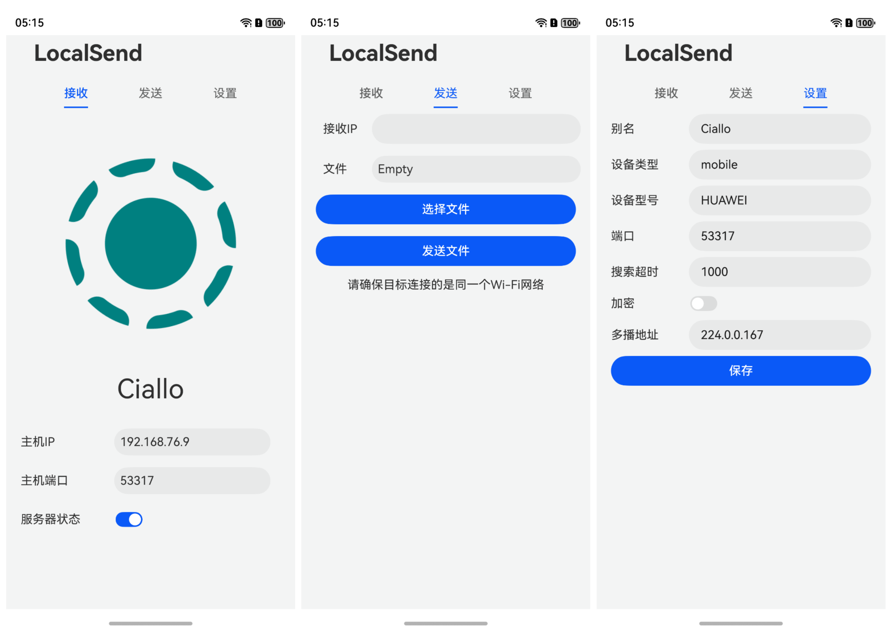

# LocalSendLite_HarmonyOS_NEXT
为HarmonyOS NEXT开发的基于LocalSend协议的轻量版实现

[English](./README_en-US)
## Roadmap
- [x] 发送文件功能 & 发送页
- [x] 接收文件功能 & 接收页
- [x] 编辑各项设置 & 设置页
- [ ] HTTPS支持
- [ ] 签发（生成）SSL/TLS证书用于HTTPS传输
- [ ] 更多传输格式支持(如文件夹、剪贴板、文本等)
- [ ] 局域网设备自发现和广播
- [x] 服务器停止和重启功能
- [ ] 更多响应码支持

## 参考及使用的第三方库
- [LocalSend Protocol](https://github.com/localsend/protocol)
- [Polka for HarmonyOS Next](https://ohpm.openharmony.cn/#/cn/detail/@ohos%2Fpolka)
- [harmony-utils](https://ohpm.openharmony.cn/#/cn/detail/@pura%2Fharmony-utils)
- [Crypto-JS for HarmonyOS Next](https://gitee.com/openharmony-sig/crypto-js)
- [OpenHarmony三方库中心仓](https://ohpm.openharmony.cn/#/cn/home)

## 其他推荐项目
- [LocalSend(Official)](https://github.com/localsend/localsend)
- [ArkTS-X Version](https://github.com/azhu003/localsend-harmony)

## 截图
