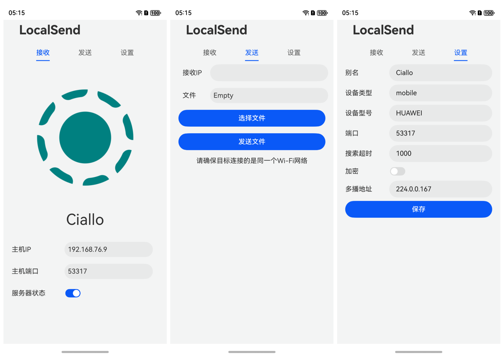

# LocalSendLite_HarmonyOS_NEXT
A third party implementation of LocalSend protocol for HarmonyOS NEXT
Only support HTTP for now, please disable encryption

[简体中文](./README)
## Roadmap
- [x] Send File & Send Page
- [x] Receive File & Receive Page
- [x] Modify Settings & Setting Page
- [ ] HTTPS Support
- [ ] Issuing Self-Signed SSL/TLS Certificate(for https transport purpose)
- [ ] More Transport Format Support(Folder, Paste, text, etc.)
- [ ] Self-discovery and multicast in LAN
- [x] Stop and Restart Server
- [ ] More Response Code Support

## Reference & Support
- [LocalSend Protocol](https://github.com/localsend/protocol)
- [Polka for HarmonyOS Next](https://ohpm.openharmony.cn/#/cn/detail/@ohos%2Fpolka)
- [harmony-utils](https://ohpm.openharmony.cn/#/cn/detail/@pura%2Fharmony-utils)
- [Crypto-JS for HarmonyOS Next](https://gitee.com/openharmony-sig/crypto-js)
- [OpenHarmony Third-Party Library Repository](https://ohpm.openharmony.cn/#/en/home)

## Other Recommended Project
- [LocalSend(Official)](https://github.com/localsend/localsend)
- [ArkTS-X Version](https://github.com/azhu003/localsend-harmony)

## Screenshot
